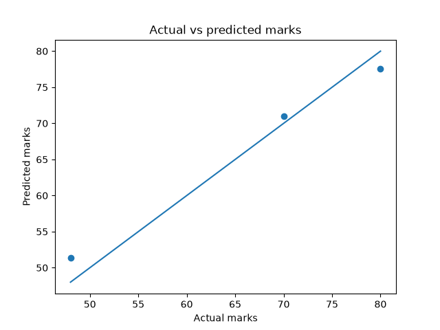

# Student Performance Prediction using Linear Regression

## Project Overview
This Machine Learning project predicts a student's final marks based on:

- Study Hours
- Attendance
- Previous Marks

The project uses Linear Regression to learn patterns from historical student data and predict the final marks of new students.

---

## Technologies Used

- Python
- Pandas
- Scikit-Learn
- Matplotlib

---

## Dataset

Features:
- Study_Hours
- Attendance
- Previous_Marks

Target:
- Final_Marks

Sample Data:

| Study_Hours | Attendance | Previous_Marks | Final_Marks |
|------------|------------|---------------|------------|
| 5 | 80 | 65 | 70 |
| 7 | 90 | 75 | 82 |
| 3 | 60 | 50 | 55 |

---

## Machine Learning Workflow

1. Load Dataset
2. Data Preprocessing
3. Feature and Target Selection
4. Train-Test Split
5. Linear Regression Model Training
6. Prediction
7. Model Evaluation

---

## Model Performance

- MAE (Mean Absolute Error): 2.28
- R² Score: 0.96

The model predicts student marks with good accuracy and low prediction error.

---

## Visualization

Actual vs Predicted Marks Graph:



---

## Project Structure

```text
student-performance-prediction/
│
├── Ml_Project.py
├── student_data.csv
├── graph.png
└── README.md
```

---

## Author

Harshal Kashyap

B.Tech Computer Science Engineering

Ajeenkya DY Patil University
